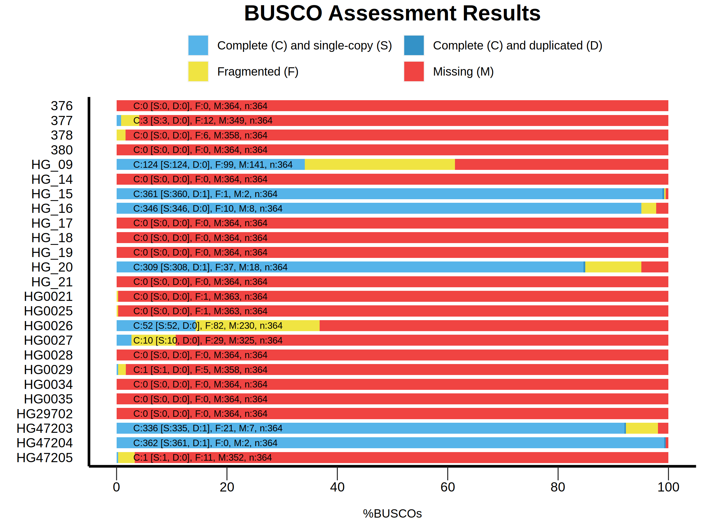
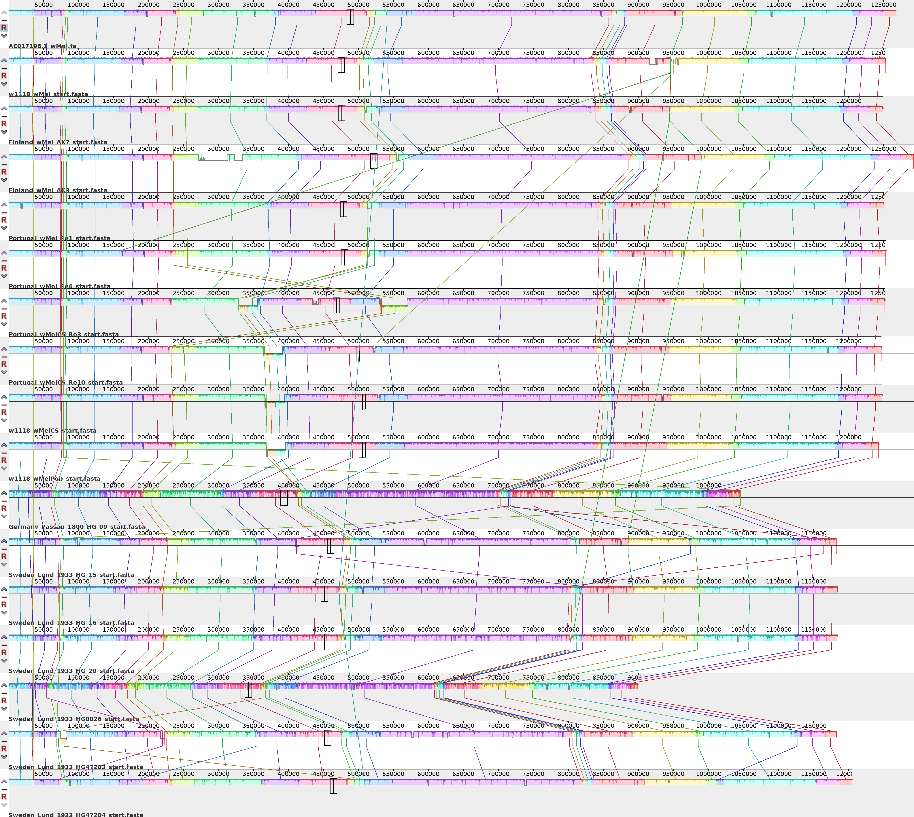
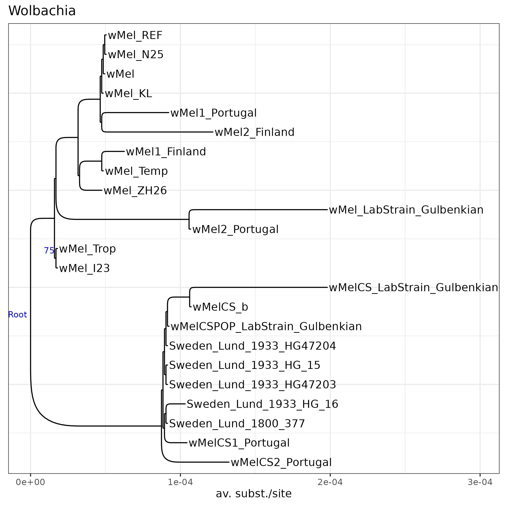
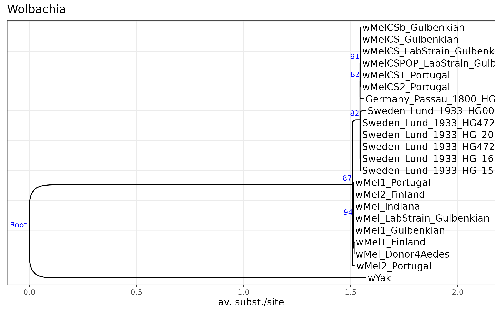
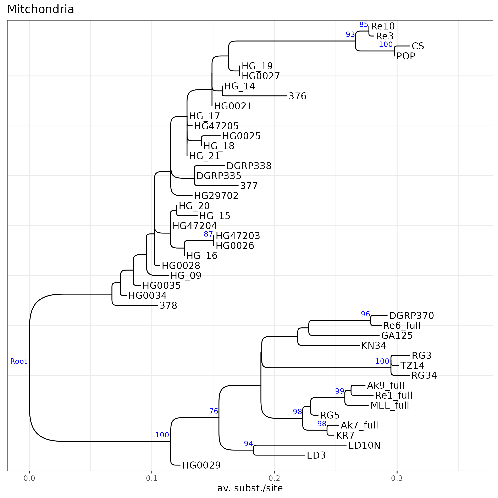
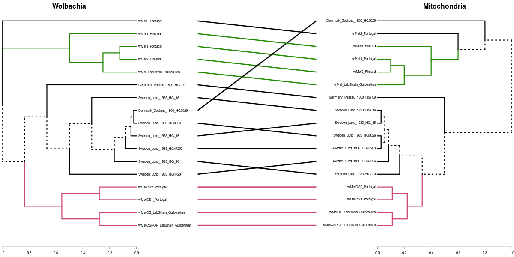

## Historic museum samples provide evidence for a recent replacment of _Wolbachia_ variants in European _Drosophila melanogaster_.

Anton Strunov1, Sandra Kirchner2, Julia Schindelar2, Luise Kruckenhauser2, Elisabeth Haring2, Martin Kapun1,2,*

1 Medical university of Vienna, Center for Anatomy and Cell Biology

2 Natural History Museum, Central Research Laboratories

* Corresponding Author: Martin Kapun [martin.kapun@meduniwien.ac.at](mailto:martin.kapun@meduniwien.ac.at)

### Abstract 

### 1. Introduction

_Wolbachia_ is a gram-negative alpha-proteobacterium of the order Rickettsiales, which represents one of the most common endosymbionts in animals. _Wolbachia_, which have been detected in XXX percent of all arthropds, can have a substantial impact on the life history and fitness of its host. These effects range from parasitic to mutualistic, since _Wolbachia_ often manipulates the host reproduction for it's own benefit but 

### 2. Materials and Methods

In this study, we investigated _Wolbachia_ infections in 25 historic _D. melanogaster_ museum samples from Sweden, Denmark and Germany, that were collected between 90 and 200 years ago (REF). Taking advantage of recently published whole genomic Illumina deep sequencing data of the samples, we tested for the presence of _Wolbachia_-specific reads in these samples, estimated titer variation and investigated the relatedness to contemporary _Wolbachia_ strains. Complementary to the historic samples, we used Oxford Nanopore sequencing technology (ONT) to newly sequence genomic DNA of six strain of freshly collected isofemale lines from wild populations in Portugal and Finland, that were naturally infected with either the wMel or the wMelCS _Wolbachia_ variants (REF) and of three lab-strains that were artifically infected previously with wMel, wMelCS and wMelPOP (REF; see Table S1). Complementary to these data, we obtained XXX RefSeq assemblies of _D. melanogaster_-specific _Wolbachia_ samples and included raw Illumina sequencing data of XXX _Drosophila melanogaster_ samples infected with wMel or wMelCS from the NCBI Short Read Archive (SRA) for phylogenetic analyses (see Table S1). Given the close relationship between wYak and wMel, we obtained the RefSeq sequence information of the wYak _Wolbachia_ variant (NZ_VCEF01000001.1) and the mitochondrion () of _D. yakuba_ and used these as outgroups for phylogenetic inference.

#### 2.1 DNA extraction, library preprartion and ONT whole genome sequencing

TBA

#### 2.2 Detection and characterization of _Wolbachia_ infections

To obtain estimates of _Wolbachia_ titers, we used bwa mem (REF) for Illumina sequencing data or minimap2 (REF) for ONT sequencing data to map all raw FASTQ reads for each sample against a joint reference sequence, which was constructed from the _Drosophila melanogaster_ reference genome v.6 (REF) and additional genome sequences of other common microbial symbionts, including the wMel reference genome (see REF for more details). Using the command _samtools depth_ of the samtools program (REF) in combination with a custom _python_ script (SumReadDepths.py), we calculated average absolute read depths for all _Drosophila_ chromosomes and symbiont genomes. Based on this information, we estimated relative _Wolbachia_ titers for a given sample by dividing the average read depth at the _Wolbachia_ genome by the average absolute read depth across all _Drosophila_ autosomes. Based on the average read depth and the proportion of the _Wolbachia_ genome covered (>30% covered by reads at >4-fold read depth), we classified _Drosophila_ samples as either infected with _Wolbachia_ or as uninfected. 

#### 2.3 De-Novo assembly and draft annotation

In a next step, we pre-filtered the raw FASTQ files of each library with Kraken (REF) using a custom-built databset that consisted of the published genomes of wMel (XXX), wMelCS (XXX) and wMelCS POP (XXX) and only retained Illumina and ONT reads which matched the references in the database. Illumina reads of the historic samples were quality-trimmed (PHRED-scaled basequality >=25) and trimmed for sequencing adapters using cutadapt (REF). We only retained intact read-pairs with a minimum length of 75bp for de-novo assembly with SPAdes (REF) using default parameters. Raw long-fragment reads from ONT sequencing of contemporary flies were assembled with Flye (REF) using default paramters. 

Subsequently, we assessed the assembly quality based on common quality statistics such as numbers of contigs, N50 and N90 with QUAST (REF) and tested for assembly completeness using the BUSCO approach, where the proportion of intact, fragmented and missing benchmarking universal single-copy orthologs specific to the bacterial order Rickettsiales (rickettsiales_odb10) was evaluated in each assembled genome (REF). In addition, we re-mapped the raw reads to the assembled contigs using minimap2 (REF) to assess variation in read-depth and compared all contigs to a local copy of the NCBI _nt_ database using _blastn_ of the BLAST suite (REF). After that, we visulized the results of these quality assessments with Blobtools (REF).

Finally, we used the published _Wolbachia_ wMel reference genome (ENA|AE017196|AE017196.1) as a backbone to align and orient the raw contigs with _nucmer_ of the MUMmer package (REF). Based on _show-tiling_ of the MUMmer package, we identified the minimum number of unique contigs that span a maximum of the reference backbone. Using a custom python script (), we then combined these contigs into a single scaffold and filled the gaps between each pair of consecutive contigs with a string of ten N's. Moreover, given that the bacterial genome is circular, we anchored the newly assembled scaffolds at the startpoint of the reference genome and shifted pretailing sequences to the end of the scaffolds. We then calculated multiple genome alignments of all scaffolds and the _Wolbachia_ reference using progressive-mauve (REF) and visualized the alignemnt with Mauve GUI (REF).

Since RNASeq data was neither available for the historic nor for the contemporary samples, we computed a draft genome annotation based on comparing the genomic sequences of the assemblies to a reference wMel (ENA|AE017196|AE017196.1) transcriptome by gapped alignment using the _protein2genome_ model of exonerate (REF). Conservatively, we only retained gene models with reached at least 80% of the maximum alignment score optainable for a given sequence.

#### 2.4 Phylogenetic analysis 

We employed two complementary approaches to explore the evolutionary history of _Wolbachia_ based on phylogenetic inference. 

##### 2.4.1 Phylogenetic analysis based on candidate genes

In a first approach, we compared the nucleotide sequences of gene models obtained with the BUSCO approach from the denovo assembled genomes of the museum and the contemporary samples. In addition, we supplemented our dataset with XXX published genomes assemblies of _Wolbachia_ samples from _D. melanogaster_ hosts available at the NCBI RefSeq database (XXX). We included these independently assembled genomes to confirm that phylogenetic signals are neither confounded or biased by our assembly pipeline nor by combining Illumina and Oxford Nanopore sequencing data.

To obtain a core set of orthologous genes, we applied the BUSCO approach as explained above to all assembled genomes and focused on 104 genes, which were identified as complete and which were present in the majority of the assembled genomes in our dataset. Using MAFFT (REF), we aligned their nuclear sequences across all samples and concatenated the alignments with a custom Python script (ConcatenateAlignments.py). Then, we reconstructed a maximum likelihood tree based on the GTR-Gamma substitution model from 20 starting trees using RaXML (REF) and additionally performed 100 rounds of bootstrapping to test for the robustness of each node. The final tree was plotted in _R_ (REF) using the _ggtree_ package (REF).

##### 2.4.2 SNP-based phylogenetic analysis

Several of the draft _Wolbachia_ genomes assembled from raw Illumina reads of historic samples, were charcaterized by very low numbers of complete BUSCO genes (<5 genes). Thus, it was not possible to include these samples in the phylogenetic approach based on candidate gene alignment explained above. We therefore employed a complementary approach based on reference mapping to include more of the historic samples into the phylogenetic analsyis. To this end, we mapped the raw Illumina reads of each sample that we pre-filtered for _Wolbachia_ with Kraken, as explained above, against the wMel reference genome (AE017196.1). For the Illumina sequencing data of historic samples and contemporary samples downloaded from NCBI SRA, we mapped paired-end reads using bwa mem (REF) with default settings. Conversely, we used minimap with default paramters to map long-fragment reads from ONT sequencing against the reference _Wolbachia_ genome. Raw BAM files were filtered with Samtools (XXX) to contain mapped reads only and sorted by reference position using the _samtools sort_ command. 

Then, we used the BCFtools (XXX) command _bcftools mpileup_ to synchronize the mapped reads of all samples and called SNPs using _bcftools call_ assuming haploidy and stored the variants in the VCF file format. Using a custom Python script (BCF2Phylip.py) we converted the VCF file to the phylip format, only considering bi-allelic polymorphic positions where the posterior probability of the most likely genotype was > 50 and of the alternative genotype <30. In addition, we only included positions with more than 5-fold coverage in each of the samples and removed samples, with more than 50% missing information across all SNPs. Similar to above, we used the aligned SNP data to reconstruct a maximum likelihood tree based on the GTR-CAT substitution model from 20 starting trees using RaXML (REF) and additionally performed 100 rounds of bootstrapping to test for the robustness of each node. The final tree was plotted in _R_ (REF) using the _ggtree_ package (REF).

##### 2.4.3 Classification based on diagnostic SNPs

The two aforementioned phylogenetic approaches allowed to determine the evolutionary relationship of historic _Wolbachia_ samples to contemporary _Wolbachia_ strains for a handful of the museum samples. However, several other samples which appeared to be infected with _Wolbachia_ did not have sufficient coverage to be included in these two analyses. We thus choose a different strategy to estimate if these are more closely related to wMel or wMelCS. We therefore identified 115 SNPs in 15 contemporary samples that were fixed for different alleles in the eight wMel and the seven wMelCS samples. Then, we tested the allelic state at these diagnostic SNPs in the 13 historic samples that were putatively infected with _Wolbachia_ whenever the read-depth was >=2 and the allelic state was unambigously identified based on the posterior probablity as explained above.

#### 2.5 Comparsion to mitochondrial phylogeny

_Wolbachia_ and the host mitochondria are both transmitted maternally to the offspring and should thus share a similar evolutionary history. This allows to test for genomic signals of horizontal introgression of _Wolbachia_ into a host, which would manifest in inconsistencies among the species trees of mitchondria and _Wolbachia_. We therefore employed the SNP-based phylogenetic approach described above based on mitchondrial reads, which we pre-filtered by comparing all raw reads against a custom-built Kraken database consisting of the _D. melanogaster_ mitochondrial genome. To this end, we first included all historic samples irrespective of the _Wolbachia_ infection status. Subsequently, we restricted the analyses to samples only, which were _Wolbachia_ infected and for which mitochondrial reads were available as well. We then repeated the phylogenetic analysis with RaXML as explained above and then used function _as.dendrogram_ from the _R_ package _phylogram_ (REF) to convert the _Wolbachia_ and mitochondrial tree files in NEWICK format to ultrametric trees. We first untangled the two trees, i.e., we swapped the branches to best fit the order of the samples using the _untangle_ function with the "step1side" method of the _dendextend_ package (XXX) and then produced a tanglegram using the _tanglegram_ function to visualize the relationship between the two trees.

### 3. Results & Discussion

In this study we took advantage of a recently published genomic dataset of 25 museum samples of  _D. melanogaster_ samples that were collected betwen 220 and 90 years ago in Northern Europe. Besides testing if museomics of century-old _Drosophila_ samples allows to identify historic _Wolbachia_ infections, we address several long-standing questions concerning the co-evolution of _D. melanogaster_ and _Wolbachia_. In particular, these data for the first time allow to test the hypothesis that the wMelCS _Wolbachia_ variant, which is now found only at low frequencies in world-wide _D. melanogaster_ populations was only recently replaced by the more common wMel variant within the last century.

#### 3.1 _Wolbachia_ infections in historic samples

As a first step, we classified the sequenced _Drosophila_ samples as infected or uninfected based on reference mapping. We found that read-depths of reads mapping to the _Wolbachia_ reference varied between 

>Table 1. Table showing Sample ID's, accession numbers and sequencing technology used for the data generation of samples used in this study. Additionally, this table provides summary statitsics from mapping the raw reads against the wMel reference genome (ENA|AE017196|AE017196.1) and shows the proportion of the total reference sequence that is covered by reads, the mean read depth, the mean basequality and the mean mapping quality of each sample.

| NewID                          | OriginalID   | NCBI Accession | Sequencing Technology | Reference Coverage \[\%\] | Mean ReadDepth | Mean BaseQual | Mean MappingQual |
| ------------------------------ | ------------ | -------------- | --------------------- | ------------------------- | -------------- | ------------- | ---------------- |
| Sweden_Lund_1800_376           | 376          | SRR23876563    | Illumina              | 30.6                      | 4.26           | 36.3          | 50.7             |
| Sweden_Lund_1800_377           | 377          | SRR23876584    | Illumina              | 94.8                      | 45.19          | 36.3          | 54.3             |
| Sweden_Lund_1800_378           | 378          | SRR23876583    | Illumina              | 88.5                      | 51.17          | 36.3          | 53.9             |
| Sweden_Lund_1800_380           | 380          | SRR23876582    | Illumina              | 15.4                      | 2.10           | 36.3          | 49               |
| Sweden_Lund_1933_HG0021        | HG0021       | SRR23876586    | Illumina              | 3.8                       | 0.72           | 36.4          | 36.8             |
| Sweden_Lund_1933_HG0025        | HG0025       | SRR23876585    | Illumina              | 0.9                       | 0.16           | 36.3          | 42               |
| Sweden_Lund_1933_HG0026        | HG0026       | SRR23876567    | Illumina              | 99.8                      | 194.82         | 36.3          | 54.3             |
| Sweden_Lund_1933_HG0027        | HG0027       | SRR23876574    | Illumina              | 33.3                      | 5.43           | 35.9          | 55               |
| Sweden_Lund_1933_HG0028        | HG0028       | SRR23876568    | Illumina              | 5.2                       | 1.92           | 36.3          | 42.6             |
| Denmark_Zealand_1800_HG0029    | HG0029       | SRR23876565    | Illumina              | 23.7                      | 4.31           | 36.1          | 46.5             |
| Sweden_Lund_1800_HG0034        | HG0034       | SRR23876564    | Illumina              | 56.8                      | 19.09          | 36.3          | 53.9             |
| Sweden_Smaland_1800_HG0035     | HG0035       | SRR23876566    | Illumina              | 5.7                       | 1.67           | 36.3          | 50.8             |
| Germany_Passau_1800_HG_09      | HG_09        | SRR23876562    | Illumina              | 99.9                      | 217.00         | 36.3          | 54.7             |
| Sweden_Lund_1933_HG_14         | HG_14        | SRR23876581    | Illumina              | 3.2                       | 0.86           | 36.4          | 43.3             |
| Sweden_Lund_1933_HG_15         | HG_15        | SRR23876580    | Illumina              | 100.0                     | 723.38         | 36.3          | 55               |
| Sweden_Lund_1933_HG_16         | HG_16        | SRR23876579    | Illumina              | 100.0                     | 976.46         | 36.2          | 54.6             |
| Sweden_Lund_1933_HG_17         | HG_17        | SRR23876578    | Illumina              | 3.6                       | 0.73           | 36.4          | 42.9             |
| Sweden_Lund_1933_HG_18         | HG_18        | SRR23876577    | Illumina              | 2.9                       | 1.23           | 36.3          | 41.4             |
| Sweden_Lund_1933_HG_19         | HG_19        | SRR23876576    | Illumina              | 4.1                       | 0.90           | 36.3          | 45.2             |
| Sweden_Lund_1933_HG_20         | HG_20        | SRR23876575    | Illumina              | 100.0                     | 304.74         | 36.3          | 54.6             |
| Sweden_Lund_1933_HG_21         | HG_21        | SRR23876573    | Illumina              | 4.0                       | 0.40           | 36.4          | 35.4             |
| Germany_Passau_1800_HG29702    | HG29702      | SRR23876569    | Illumina              | 5.3                       | 0.58           | 36.5          | 36.1             |
| Sweden_Lund_1933_HG47203       | HG47203      | SRR23876570    | Illumina              | 100.0                     | 136.47         | 36.4          | 54.1             |
| Sweden_Lund_1933_HG47204       | HG47204      | SRR23876571    | Illumina              | 100.0                     | 496.44         | 36.3          | 54.9             |
| Sweden_Lund_1933_HG47205       | HG47205      | SRR23876572    | Illumina              | 24.0                      | 2.14           | 35.9          | 45.4             |
| wMelCS_Gulbenkian              | wMelCS       | SRR945468      | Illumina              | 100.0                     | 1290.01        | 24.6          | 55.2             |
| wMelCSb_Gulbenkian             | wMelCSb      | SRR10438626    | Illumina              | 100.0                     | 34.80          | 37.3          | 56.8             |
| wMel_Donor4Aedes               | wMel_donor   | SRR17978916    | Illumina              | 100.0                     | 53.74          | 35.9          | 56.7             |
| wMel_Indiana                   | wMel_Indiana | SRR1645077     | Illumina              | 100.0                     | 388.55         | 35.5          | 56.6             |
| wMel1_Gulbenkian               | wMel_run1    | SRR10424182    | Illumina              | 100.0                     | 22.49          | 34.1          | 56.9             |
| wMel1_Portugal                 | Re1_full     | #NA            | Oxford Nanopore       | 100.0                     | 13.58          | 24.3          | 58.6             |
| wMelCS1_Portugal               | Re3          | #NA            | Oxford Nanopore       | 99.9                      | 19.19          | 24.6          | 58.5             |
| wMel2_Portugal                 | Re6_full     | #NA            | Oxford Nanopore       | 100.0                     | 20.14          | 24.3          | 58.3             |
| wMelCS2_Portugal               | Re10         | #NA            | Oxford Nanopore       | 100.0                     | 14.61          | 24.6          | 58.3             |
| wMel1_Finland                  | Ak7_full     | #NA            | Oxford Nanopore       | 100.0                     | 17.22          | 24.3          | 58.5             |
| wMel2_Finland                  | Ak9_full     | #NA            | Oxford Nanopore       | 100.0                     | 25.67          | 24.2          | 58.8             |
| wMel_LabStrain_Gulbenkian      | MEL_full     | #NA            | Oxford Nanopore       | 100.0                     | 14.20          | 24.2          | 58.5             |
| wMelCS_LabStrain_Gulbenkian    | CS           | #NA            | Oxford Nanopore       | 100.0                     | 15.15          | 24.6          | 58.1             |
| wMelCSPOP_LabStrain_Gulbenkian | POP          | #NA            | Oxford Nanopore       | 100.0                     | 49.36          | 24.7          | 58.2             |

#### 3.2 DeNovo Assemblies

#### 3.3 Comparing genomes

#### 3.3 _Wolbachia_ phylogeny

##### 3.3.1 Candidate genes

##### 3.3.2 SNP-based

_Wolbachia_ 

Mitochondira 

##### 3.3.3 Tanglegram

### Discussion

### Acknowledgments 

### References